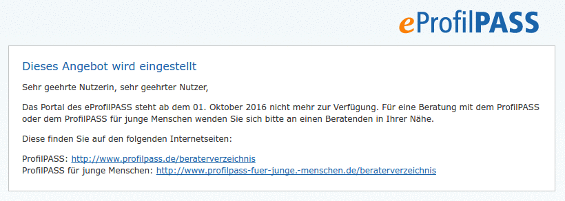
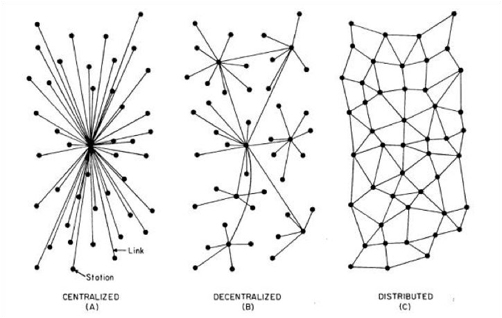

% Überlegungen zu einem E-Portfolio für das lebensbegleitende Lernen
% Axel Dürkop, MA, iTBH, TU Hamburg
% ÖZBF-Kongress, Salzburg, 21. Oktober 2016

## Agenda

1. Zur Person: Vorstellung und Hintergrund
1. Gedanken zum Konzept
1. Gedanken zur Didaktik
1. Gedanken zur Technik
1. Zusammenfassende Betrachtung und Diskussion

# Vorstellung und Hintergrund

-----------

### Zur Person

- Studium der Philosophie und Literaturwissenschaft
- zehn Jahre Arbeit als Regisseur, Darsteller und Musiker an deutschen Stadt- und Staatstheatern
- Autodidakt im Bereich der Informationstechnologie
- mehrere Jahre freiberuflicher Dozent im Bereich Webtechnologien sowie in der Erwerbslosenförderung und -weiterbildung
- wiss. Mitarbeiter und Dozent am [Institut für Technische Bildung und Hochschuldidaktik (iTBH)](http://itbh-hh.de/de/institut/mitarbeiter/axel-duerkop) an der TU Hamburg unter Leitung von Prof. Dr. Sönke Knutzen
- laufende Promotion zum Thema *Offenheit in der digital gestützten Lehre*

------------

### Erfahrung mit E-Portfolios

- Mitglied (Programmierer) im Entwicklungsteam des
    - *[Ausbildungsportfolio der Kompetenzwerkstatt 2.0](https://ausbildungsportfolio.net/app/login)*, (Dürkop & Knutzen, 2014; Howe & Knutzen, 2007)
    - *[Kompetenzcheck](http://integration-kompetenzchecks.wabsolute.de:8080/login)*, Browsertool zur Kompetenzfeststellung und -entwicklung
    - Betreuung der Weiter- bzw. Neuentwicklung

--------------

### Das Ausbildungsportfolio

<small>Abbildung: Startseite des Ausbildungsportfolios</small>

-------------

### Der Kompetenzcheck

<small>Abbildung: Startseite des Kompetenzchecks</small>

# Gedanken zum Konzept
##

Wissen und Kompetenzen werden im Laufe eines Lebens erworben

- an unterschiedlichen Orten
- mit variablem zeitlichem Abstand
- in unterschiedlicher Form (theoretisch/praktisch)

<small style="float: right;">Dürkop, 2015</small>

------

- Wissens- und Kompetenzerwerb im Rahmen formaler Bildungszusammenhänge

<small>Abbildung: E-Portfolios im Kontext lebensbegleitenden Lernens. Quelle: Dürkop, 2015</small>

- Integration informell erworbener Kompetenzen

------------------

### Zusammenschau im Ausbildungsportfolio

<small>Abbildung: Zusammenschau von E-Portfolioeinträgen aus der "Vogelperspektive". Quelle: Ausbildungsportfolio</small>

-----------------

### Strukturierungsfunktion

*Lernortkooperation im Kopf* kann helfen, Wissen und Kompetenzen - erworben an unterschiedlichen Orten im Laufe der Zeit - *zusammenzuschauen*.

<small style="float: right;">Elsholz & Knutzen, 2009; Dürkop, 2015</small>

---------------

### Kernelemente von Kompetenzentwicklung

Theoretische Fundierung des [eProfilPASS](https://www.eprofilpass.de/):

1. Biografische Arbeit
1. Tätigkeitsanalyse
1. Belegen von Kompetenzen
1. Formulieren von Zielen und Festlegen nächster Schritte
1. Auseinandersetzung mit Werten

<small style="float: right;">Pielorz & Westebbe, 2014, S. 102 f.</small>

---------------

### Anforderungen für E-Portfolios:

- biografisch und subjektorientiert
- auf die Fachlichkeit bezogen
- begleitet in der Selbstreflexion
- durch unabhängige Institutionen unterstützt
- anschlussfähig in der Folge berufsbiografischer Abschnitte
- Selbstmarketing
- Erstellung von Kompetenzprofilen

<small style="float: right;">Elsholz, 2014; Thomas, 2014</small>

# Gedanken zur Didaktik
##

- (E-)Portfolioarbeit muss behutsam eingeführt werden.
- Sie kostet viel **Selbstdisziplin**, bevor Mehrwerte sichtbar werden.
- Reflektieren will **gelernt** sein.
- (E-)Portfolio**arbeit** muss wertgeschätzt werden.
- Für (E-)Portfolioarbeit muss im Unterricht (viel) Zeit eingeräumt werden.

----------

- (E-)Portfolioarbeit kann nicht auf den Lernenden abgewälzt werden.

- Der Lehrende/Beratende behält eine wichtige Rolle bei der Reflexionsarbeit.

- Eine Lösung besteht folglich nicht in der IT allein. Vielmehr ist E-Portfolioarbeit ein komplexes sozio-technisches System mit mehreren Akteur_innen.

--------

>"[...] trägt die Verantwortung dafür, dass 'biografisches Material' in ausreichender Fülle 'zum Vorschein' kommt."

<small style="float: right;">eProfilPASS, Pielorz & Westebbe, 2014, S. 103</small>

# Gedanken zur Technik
##

### E-Portfolios

>"[...] any digital system supporting reflexive learning and practice by allowing a person (or an organisation) to collect, manage, and publish a selection of learning evidence in order to have one's assets recognised, accredited or plan future learning"

<small style="float: right;">Ravet, 2009, S. 4</small>

-------------

### Merkmale von Tools

- ubiquitär zugänglicher Datenspeicher
- Interaktions- und Kommunikationsmedium
- Präsentationsfunktion
- Verfügungsgewalt über die Daten
- Strukturierungsfunktion

<small style="float: right;">nach Thomas, 2014, S. 164</small>

---------------

### Migrationsfähigkeit von Technik und Inhalten

- *schlanke Stacks* für technische Systeme
    - keine Monolithen, lose Kopplungen für ein *PLE (Personal Learning Environment)*
    - Blogs, Single-User-Portfolios
- Kapselung von Texten und Artefakten in "zeitlosen" Formaten und Containern
    - XML und Markdown
- Trennung von Inhalten und Systemen
- Definition einheitlicher Schnittstellen für Import und Export
- offen für einschneidende Innovationen
    - gestern das Smartphone - und morgen?

-----------

### Nachhaltigkeit

<small>Abbildung: https://www.eprofilpass.de/, 20.10.2016</small>

- Beispiel: Ausbildungsportfolio - Weiterentwicklung noch nicht verstetigt
- Welches Geschäftsmodell für lebensbegleitende Infrastrukturen?

# Inspirationen und Visionen
##

### Architekturen
- E-Portfolios: *distributed* statt *centralized*?
  
<small>Abbildung: Raval, 2016, S. 3</small>

------------

### Domain of One's Own

- University of Mary Washington u.a.
- Allen Studierenden eine eigene Domain und Webspace

<small>Abbildung: [Homepage der UWM](http://umwdtlt.com/documentation/)</small>
- *communities of practice* durch Vernetzung von Blogs

--------------

### IPFS und Blockchain

- *[IPFS: Interplanetary Filesystem](https://ipfs.io/)* für das *Permanent Web*
    - keine Server, Datenhaltung auf dem eigenen Rechner
    - Interessierte entdecken einander und duplizieren nur die notwendigen Daten

In Kombination mit [Blockchain](http://www.golem.de/news/blockchain-eine-technik-zwischen-hype-und-wirklichkeit-1510-116573.html) entstehen dezentrale/distribuierte Datenspeicher, deren Daten beim Nutzer liegen und kryptografisch gesichert sind.

Ist es wünschenswert für E-Portfolioarbeit, wenn das Netz nichts mehr vergisst?

-----------

### Chatbots und Machine Learning

- Kleist, *Über die allmähliche Verfertigung der Gedanken beim Reden*

- Chatbots könnte die Rolle von Molieres Reinigungskraft zukommen
- *Machine Learning* und *Data Mining* zur Analyse von Portfolioinhalten
- Wechsel des Bots von passiv zu aktiv
- Altern Chatbots mit ihren Nutzer_innen?
- Können Chatbots in der Zukunft Beratende und "Reflexionshelfer_innen" ersetzen?

# Diskussion

## Kontakt

Axel Dürkop  
Institut für Technische Bildung und Hochschuldidaktik  
Am Irrgarten 3-9  
21073 Hamburg  
Web: [Axel Dürkop](http://itbh-hh.de/de/institut/mitarbeiter/axel-duerkop)  
Mail: axel.duerkop@tuhh.de  
Twitter: @[xldrkp](https://twitter.com/xldrkp)  
GitHub: [xldrkp](https://github.com/xldrkp)

## Referenzen

- Benet, J. (2014). [IPFS - Content Addressed, Versioned, P2P File System (DRAFT 3)](http://arxiv.org/abs/1407.3561). arXiv preprint arXiv:1407.3561. Zugriff am 19.10.2016.
- Dürkop, A. (2015). Hochschuldidaktischer Einsatz von E-Portfolios zur Zusammenschau raumzeitlich getrennter Wissenskonstruktion. In G. Kammasch & R. Dreher (Hrsg.), Wie viel (Grundlagen)Wissen braucht technische Bildung? - Wege zu technischer Bildung. Referate der 9. Ingenieurpädagogische Regionaltagung 2014 an der Universität Siegen vom 6. - 8. November 2014 (S. 86–92). Siegen.

----------

- Dürkop, A., Elsholz, U. & Knutzen, S. (2013). Entwicklung und Einsatz eines mobilen Ausbildungsportfolios. In M. Becker, A. Grimm, A.W. Petersen & R. Schlausch (Hrsg.), [Kompetenzorientierung und Strukturen gewerblich-technischer Berufsbildung](http://books.google.de/books?id=TIxeR1IkZOMC&lpg=PA5&ots=Rdx2zQzT_J&lr&hl=de&pg=PA367#v=onepage&q&f=true) (S. 367–383). Berlin: LIT Verlag Münster.
- Dürkop, A. & Knutzen, S. (2014). Das Ausbildungsportfolio der Kompetenzwerkstatt - Mein Beruf (Erwachsenenbildung und lebensbegleitendes Lernen - Forschung & Praxis). In U. Elsholz & M. Rohs (Hrsg.), E-Portfolios für das lebenslange Lernen. Konzepte und Perspektiven (1. Auflage, Band 22, S. 41–58). Bielefeld: W. Bertelsmann.

------------

- Dürkop, A. & Klaffke, H. (2013). Kompetenzwerkstatt - Mein-Beruf. Ein berufswissenschaftliches Lehr-/Lernkonzept (Medien in der Wissenschaft). In C. Bremer & D. Krömker (Hrsg.), E-Learning zwischen Vision und Alltag (Band 64, S. 427–428). Münster.
- Elsholz, U. & Rohs, M. (2014). Herausforderungen für ein lebensbegleitendes Lernen mit E-Portfolios (Erwachsenenbildung und lebensbegleitendes Lernen - Forschung & Praxis). In U. Elsholz & M. Rohs (Hrsg.), E-Portfolios für das lebenslange Lernen. Konzepte und Perspektiven (1. Auflage, Band 22, S. 193–198). Bielefeld: W. Bertelsmann.
- Howe, F. & Knutzen, S. (2007). Die Kompetenzwerkst@tt: Ein berufswissenschaftliches E-Learning-Konzept. Göttingen: Cuvillier.

-------------

- Knauf, B., Dürkop, A. & Knutzen, S. (2014). Mobile Kompetenzerfassung zur gezielten Unterstützung von Kompetenzentwicklungsprozessen in der dualen Ausbildung (Lecture Notes in Informatics (LNI) - Proceedings). DeLFI 2014 – Die 12. e-Learning Fachtagung Informatik der Gesellschaft für Informatik e.V. (Band P-233, S. 139–144). Bonn: Köllen Druck+Verlag GmbH.
- Munz, C. (2005). Berufsbiografie selbst gestalten. Wie sich Komptenzen für die Berufslaufbahn entwickeln lassen. Bielefeld: W. Bertelsmann Verlag.

----------------

- Pielorz, M. & Westebbe, G. (2014). eProfilPASS (ePP) - ein Instrument zur Sichtbarmachung von non-formal und informell erworbenen Kompetenzen (Erwachsenenbildung und lebensbegleitendes Lernen - Forschung & Praxis). In U. Elsholz & M. Rohs (Hrsg.), E-Portfolios für das lebenslange Lernen. Konzepte und Perspektiven (1. Auflage, Band 22, S. 93–114). Bielefeld: W. Bertelsmann.
- Raval, S. (2016). Decentralized Applications. O'Reilly.
- Ravet, S. (2009). [ePortfolio a European Perspective. A report on ePortfolio readiness and state of the art technology and practice](http://www.cde-pc.it/documenti/ave_eportfolio.pdf).

------------------

- Thomas, M. (2014). E-Portfolios als Navigationshilfe in der Erwerbsbiografie (Erwachsenenbildung und lebensbegleitendes Lernen - Forschung & Praxis). In U. Elsholz & M. Rohs (Hrsg.), E-Portfolios für das lebenslange Lernen. Konzepte und Perspektiven (1. Auflage, Band 22, S. 163–176). Bielefeld: W. Bertelsmann.
- Watters, A. (2016, August 23). [A Domain of One’s Own in a Post-Ownership Society. Hack Education](http://hackeducation.com/2016/08/23/domains). Zugriff am 25.8.2016.
- Für eine Liste von Firmen/Institutionen, die ChatBots einsetzen, vgl. https://www.chatbots.org/country/at

## Lizenz

 Dieses Werk ist lizenziert unter einer <a rel="license" href="http://creativecommons.org/licenses/by/4.0/">Creative Commons Namensnennung 4.0 International Lizenz</a>.
